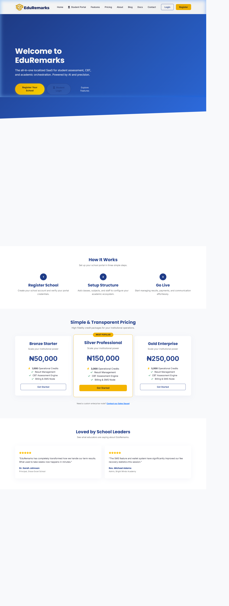
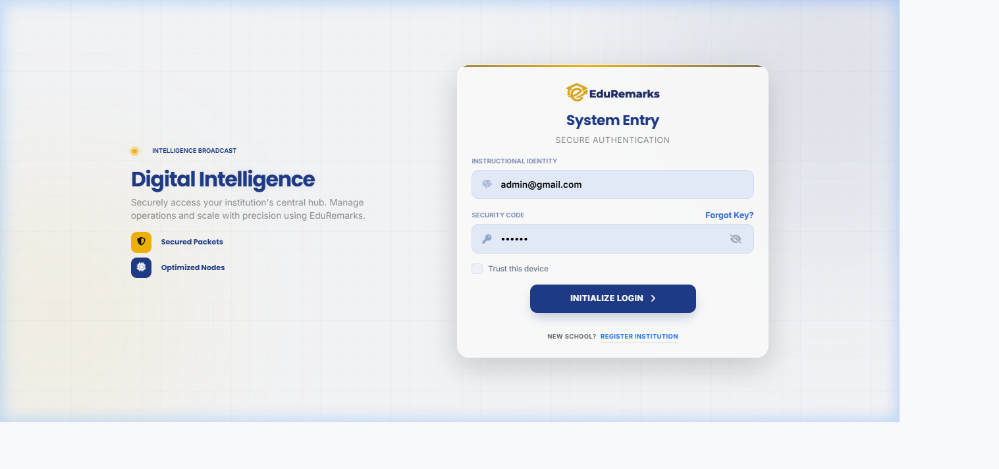
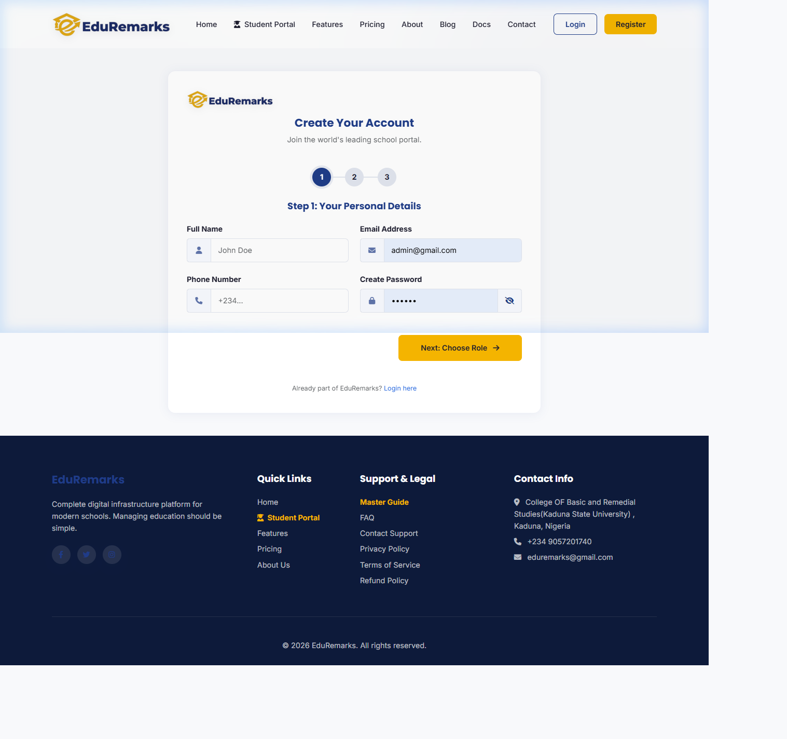
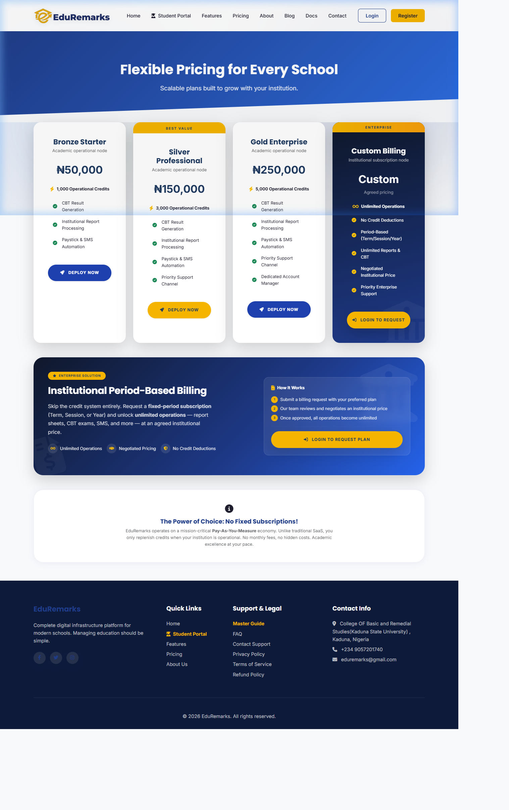
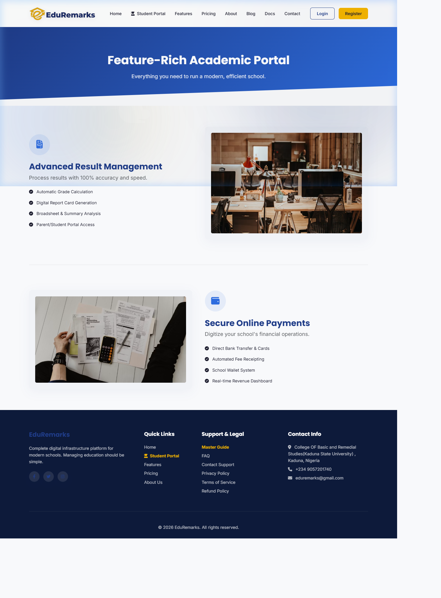

# 🎓 EduRemarks — School Management & Academic Portal Platform

<div align="center">



**A world-class, multi-school SaaS platform for complete school management, academic reporting, and institutional automation.**

[](https://php.net)
[](https://mysql.com)
[](https://getbootstrap.com)
[](https://apachefriends.org)
[](LICENSE)

[🌐 Live Demo](#) &nbsp;|&nbsp; [📖 Documentation](#documentation) &nbsp;|&nbsp; [🚀 Quick Start](#quick-start) &nbsp;|&nbsp; [💰 Pricing](#pricing-tiers)

</div>

---

## 📌 Table of Contents

- [About](#about)
- [Screenshots](#screenshots)
- [Features](#features)
- [Tech Stack](#tech-stack)
- [Project Structure](#project-structure)
- [Quick Start](#quick-start)
- [Configuration](#configuration)
- [User Roles](#user-roles)
- [Pricing Tiers](#pricing-tiers)
- [Database Setup](#database-setup)
- [SMS Integration](#sms-integration)
- [Security](#security)
- [Contributing](#contributing)
- [License](#license)

---

## 🏫 About

**EduRemarks** is a feature-rich, multi-tenant School Management System (SMS) built to power Nigerian and African schools with premium digital infrastructure. It handles everything from student admission to academic result publishing, CBT exams, billing, ID card generation, and SMS communication — all in a clean, secure, and responsive interface.

> Built for primary and secondary schools, it supports **multiple schools** on a single installation (SaaS model) with isolated data per school, credit-based billing, and a centralized super-admin control panel.

---

## 📸 Screenshots

### 🏠 Landing Page


### 🔐 School Login


### 📝 School Registration


### 💰 Pricing Plans


### ✨ Features Overview


---

## ✨ Features

### 🏫 School Administration
| Feature | Description |
|---|---|
| **Multi-School Support** | Manage multiple independent schools from one installation |
| **School Registration** | 3-step wizard for onboarding new schools |
| **Staff Management** | Add, edit, and assign roles to teaching & non-teaching staff |
| **Department & Class Setup** | Organize academics into departments, classes, and arms |
| **Admission Portal** | Full digital admission flow with form customization |
| **Curriculum Manager** | Define subjects per class and session |

### 📊 Academic Management
| Feature | Description |
|---|---|
| **Result Entry** | Per-subject, per-term score input with configurable grading |
| **Broadsheet Generation** | Auto-compiled class-wide result broadsheets |
| **Academic Orchestration** | Term/session management across the entire school |
| **History Master Entry** | Batch historical result uploads |
| **Report Templates** | Customizable termly result report cards |
| **PDF Report Generation** | Printable student report cards with school branding |
| **Skills & Traits Entry** | Behavioral/psychomotor assessment for primary schools |

### 🖥️ CBT (Computer-Based Testing)
| Feature | Description |
|---|---|
| **Question Builder** | Rich-text question editor with image support |
| **Exam Scheduler** | Set exam dates, duration, and class assignment |
| **Online Exam Engine** | Secure, timed CBT exam interface for students |
| **Auto-Grading** | Instant scoring and result display after exam |
| **CBT Result Reports** | Per-student and class-wide CBT performance analytics |

### 👩‍🎓 Student Portal
| Feature | Description |
|---|---|
| **Student Dashboard** | Personal academic overview and announcements |
| **View Reports** | Access termly report cards online |
| **Performance Charts** | Visual performance trends across subjects |
| **CBT Access** | Take scheduled online exams |
| **Exam Schedule** | View upcoming exam timetable |
| **Academic Audit** | Historical academic record review |

### 💳 Billing & Credits
| Feature | Description |
|---|---|
| **Credit Wallet** | Schools top up credits to use platform services |
| **Paystack Integration** | Secure Nigerian payment gateway integration |
| **Invoice Generation** | Auto-generated invoices for all transactions |
| **Billing History** | Full transaction audit trail |
| **Pricing Plans** | Bronze, Silver, Gold & Custom enterprise tiers |

### 📱 SMS & Communication
| Feature | Description |
|---|---|
| **Bulk SMS Campaigns** | Send SMS to students, parents, or all contacts |
| **Result Notification SMS** | Auto-notify parents when results are published |
| **SMS Credit System** | Deducted from wallet per message sent |
| **Support Tickets** | In-app support system with file attachments |

### 🪪 ID Card System
| Feature | Description |
|---|---|
| **ID Card Generator** | Design and generate school ID cards per student |
| **Draft Management** | Save ID card drafts before final printing |
| **PDF Export** | Download ID cards as print-ready PDFs |

### 🛡️ Super Admin Panel
| Feature | Description |
|---|---|
| **All Schools Overview** | Monitor all registered schools on the platform |
| **Billing Requests** | Approve and manage school top-up requests |
| **Platform Content** | Manage homepage hero images, blog posts, testimonials |
| **Pricing Control** | Set and update credit package prices |
| **Feedback Manager** | View and respond to user feedback |
| **Platform Analytics** | Usage statistics across all schools |

---

## 🛠️ Tech Stack

| Layer | Technology |
|---|---|
| **Backend** | PHP 8.x (procedural + PDO) |
| **Database** | MySQL 8.x |
| **Frontend** | HTML5, Bootstrap 5, Vanilla CSS, JavaScript |
| **Icons** | Font Awesome 6 |
| **Charts** | Chart.js |
| **PDF Generation** | TCPDF / mPDF (server-side) |
| **Payments** | Paystack API |
| **SMS** | Termii / SMS Nigeria API |
| **Server** | Apache (XAMPP) |

---

## 📁 Project Structure

```
eduremarks/
├── admin/                  # School admin panel
│   ├── dashboard.php
│   ├── students.php
│   ├── academics.php
│   ├── staff.php
│   ├── curriculum.php
│   ├── billing.php
│   ├── id_cards.php
│   ├── question_builder.php
│   ├── admission_portal.php
│   ├── sms_campaigns.php
│   ├── settings.php
│   └── ...
├── user/                   # Teacher/Staff panel
│   ├── dashboard.php
│   ├── students.php
│   ├── assessment_entry.php
│   ├── cbt_builder.php
│   ├── cbt_exams.php
│   ├── report_management.php
│   ├── generate_reports_pdf.php
│   └── ...
├── student/                # Student portal
│   ├── dashboard.php
│   ├── exam.php
│   ├── reports.php
│   ├── performance.php
│   └── ...
├── super_admin/            # Platform-level admin
│   ├── dashboard.php
│   ├── schools.php
│   ├── billing.php
│   ├── content.php
│   └── ...
├── ajax/                   # AJAX endpoint handlers
├── config/                 # Database & app config
├── css/                    # Stylesheets
├── js/                     # JavaScript files
├── includes/               # Shared PHP includes (header, footer, nav)
├── database/               # SQL migration files
├── uploads/                # User-uploaded files (logos, photos, signatures)
├── screenshots/            # App screenshots (for docs)
├── index.php               # Landing page
├── login.php               # Admin login
├── signup.php              # New school registration
├── pricing.php             # Pricing plans
├── features.php            # Features page
├── blog.php                # Blog / updates
├── documentation.php       # System documentation
└── README.md
```

---

## 🚀 Quick Start

### Prerequisites

- PHP 8.0 or higher
- MySQL 8.x
- Apache Web Server (XAMPP recommended)
- Composer (optional, for future packages)

### 1. Clone the Repository

```bash
git clone https://github.com/WQS-company/EduRemarks.git
cd EduRemarks
```

### 2. Place in Web Root

```bash
# For XAMPP on Windows
move EduRemarks C:\xampp\htdocs\dashboard\eduremarks

# For Linux/Mac (Apache)
sudo cp -r EduRemarks /var/www/html/eduremarks
```

### 3. Create the Database

```bash
# Open phpMyAdmin or run MySQL CLI
mysql -u root -p

# Create database
CREATE DATABASE eduremarks CHARACTER SET utf8mb4 COLLATE utf8mb4_unicode_ci;
```

Then import the SQL schema:
```bash
mysql -u root -p eduremarks < database/schema.sql
```

### 4. Configure Database Connection

Edit `config/database.php`:

```php
<?php
define('DB_HOST', 'localhost');
define('DB_NAME', 'eduremarks');
define('DB_USER', 'root');
define('DB_PASS', '');  // Your MySQL password
define('DB_CHARSET', 'utf8mb4');
```

### 5. Run Migrations

Visit the following in your browser to initialize platform data:

```
http://localhost/dashboard/eduremarks/seed_platform.php
http://localhost/dashboard/eduremarks/migrate_superadmin.php
```

### 6. Access the Application

| Portal | URL |
|---|---|
| 🌐 Landing Page | `http://localhost/dashboard/eduremarks/` |
| 🔐 School Admin Login | `http://localhost/dashboard/eduremarks/login.php` |
| 👩‍🎓 Student Login | `http://localhost/dashboard/eduremarks/student/login.php` |
| 🛡️ Super Admin | `http://localhost/dashboard/eduremarks/super_admin/` |

---

## ⚙️ Configuration

### Environment Settings

Key settings are stored in the `platform_settings` database table and can be managed via the Super Admin panel:

| Setting Key | Description |
|---|---|
| `hero_title` | Landing page hero title |
| `hero_subtitle` | Landing page subtitle |
| `platform_name` | Brand name shown across the app |
| `sms_api_key` | SMS provider API key |
| `paystack_public_key` | Paystack public key |
| `paystack_secret_key` | Paystack secret key |

### File Uploads

The `uploads/` directory is used for:
- `/uploads/profiles/` — Admin/staff profile pictures
- `/uploads/students/` — Student passport photos
- `/uploads/schools_logo/` — School logos
- `/uploads/signatures/` — Principal/proprietor signatures & stamps
- `/uploads/id_cards/` — Generated ID card PDFs
- `/uploads/platform/` — Platform branding assets

> **⚠️ Note:** Ensure Apache has write permissions to the `uploads/` directory.

---

## 👥 User Roles

### 🛡️ Super Admin
- Platform-level god mode
- Manages all registered schools
- Controls pricing, billing approvals, and platform content
- Views system-wide analytics

### 🏫 School Admin
- Full control of their school's data
- Manages staff, students, classes, and academic settings
- Handles billing, ID cards, and SMS campaigns
- Can configure admission forms and academic terms

### 👨‍🏫 Teacher / Staff (User)
- Enters student assessment scores
- Builds and manages CBT exams
- Generates and publishes term reports
- Manages class-specific lesson notes and curriculum

### 👩‍🎓 Student
- Views published report cards
- Takes scheduled CBT exams
- Monitors performance charts
- Access exam timetables

---

## 💰 Pricing Tiers

EduRemarks operates on a **credit-based SaaS model**:

| Plan | Price (₦) | Credits | Best For |
|---|---|---|---|
| 🥉 **Bronze Starter** | ₦50,000 | 1,000 | Small schools (< 200 students) |
| 🥈 **Silver Professional** | ₦150,000 | 5,000 | Mid-size schools |
| 🥇 **Gold Enterprise** | ₦250,000 | 10,000 | Large schools & academies |
| 🏢 **Custom** | Contact us | Unlimited | Enterprise / Government institutions |

> Credits are consumed per operation (e.g., result publications, SMS, PDF generation).

---

## 🗃️ Database Setup

The database uses PDO with MySQL. Key tables include:

| Table | Purpose |
|---|---|
| `schools` | Registered school accounts |
| `students` | Student records (per school) |
| `staff` | Staff/teacher accounts |
| `academic_sessions` | School year sessions |
| `academic_terms` | Terms within sessions |
| `classes` | School classes/grades |
| `subjects` | Subject registry |
| `student_results` | Per-subject score entries |
| `cbt_questions` | CBT question bank |
| `cbt_exams` | Scheduled CBT exams |
| `cbt_submissions` | Student exam responses |
| `billing_requests` | Credit top-up requests |
| `sms_campaigns` | Bulk SMS logs |
| `platform_settings` | Global platform config |
| `pricing_packages` | Credit purchase plans |

---

## 📱 SMS Integration

EduRemarks supports SMS notifications via configurable API providers.

### Setting Up SMS

1. Register with your SMS provider (e.g., **Termii**, **Arkesel**)
2. Get your API key and sender ID
3. Go to **Super Admin → Platform Settings** and enter your credentials

### SMS Features
- **Result publication alerts** to parents
- **Bulk campaign messages** to student/parent lists
- **Payment confirmation** notifications
- **Exam schedule reminders**

---

## 🔒 Security

EduRemarks implements multiple security layers:

- ✅ **PDO Prepared Statements** — All DB queries use parameterized queries (no SQL injection)
- ✅ **Session-based Authentication** — Separate session spaces for admin, user, and student roles
- ✅ **Password Hashing** — `password_hash()` / `password_verify()` for all credentials
- ✅ **CSRF Protection** — Token validation on sensitive forms
- ✅ **File Upload Validation** — MIME type & extension whitelisting
- ✅ **Role-based Access Control** — Routes protected per user role
- ✅ **Input Sanitization** — `htmlspecialchars()` on all user-generated output

---

## 🤝 Contributing

Contributions are welcome! Please follow these steps:

1. **Fork** this repository
2. Create a new branch: `git checkout -b feature/your-feature-name`
3. Make your changes and commit: `git commit -m "feat: add amazing feature"`
4. Push to your fork: `git push origin feature/your-feature-name`
5. Open a **Pull Request** with a clear description

### Commit Convention

We use [Conventional Commits](https://www.conventionalcommits.org/):

```
feat: add new feature
fix: bug fix
docs: documentation update
style: formatting changes
refactor: code refactoring
test: adding tests
chore: maintenance tasks
```

---

## 📄 License

This project is licensed under the **MIT License** — see the [LICENSE](LICENSE) file for details.

---

## 📞 Contact & Support

- **Developer:** WQS Company
- **GitHub:** [@WQS-company](https://github.com/WQS-company)
- **Email:** support@wqs.com.ng
- **Support:** Use the in-app Support Ticket system

---

<div align="center">

Made with ❤️ by **WQS Company** — Empowering Nigerian Schools with Digital Excellence

⭐ **If EduRemarks helps your school, please give us a star!** ⭐

</div>
